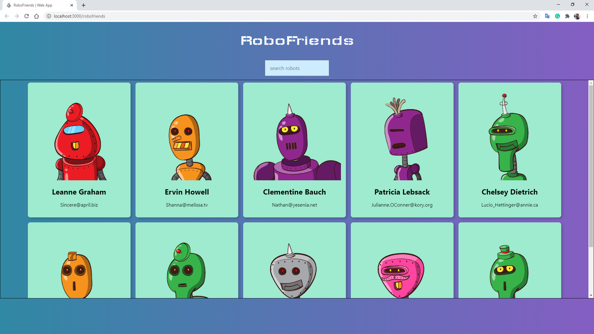
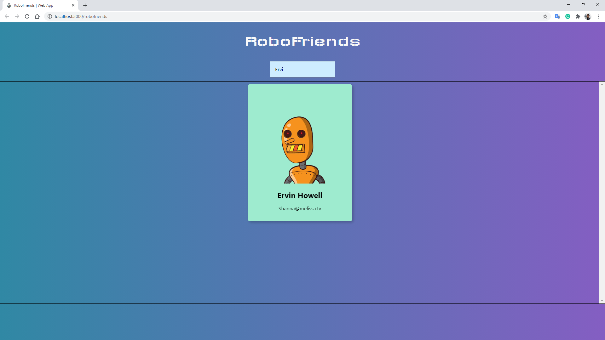

# RoboFriends React App

## The project
Web application created with **React** and deployed to GitHub Pages using the **CRA** environment.  
The application fetches data from an external **JSON** list using **REST API**.
  

### Deployed website
You can find the deployed website at https://gdhebling.github.io/robofriends/ 

### The UI
The web app consists of a simple interface in which you can filter through a list of *users* (or *robots*, in this case).  
The app uses state, props, and children, and can be extended to any other application that needs to sort through a JSON list. 
  

## That's it!
Thanks for reading! 😀  
I'm Guilherme. Front-End Web Developer.  

You can find me on:  

&nbsp;&nbsp;

&nbsp;&nbsp;

